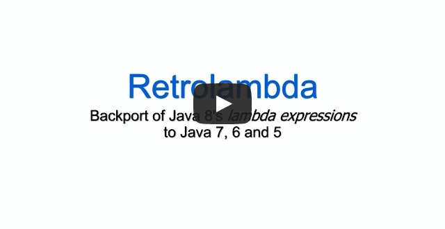

Retrolambda: Use Lambdas on Java 7
==================================

[](https://www.youtube.com/watch?v=DUdhfPh9V_s)

Just as there was *Retroweaver* et al. for running Java 5 code with
generics on Java 1.4, *Retrolambda* lets you run Java 8 code with **lambda
expressions**, **method references** and **try-with-resources statements**
on Java 7, 6 or 5. It does this by transforming your Java 8 compiled
bytecode so that it can run on an older Java runtime. After the
transformation they are just a bunch of normal .class files, without any
additional runtime dependencies.
[Read more details](#backported-language-features).

There is also [limited support](#known-limitations) for backporting
**default methods** and **static methods on interfaces**. This feature is
disabled by default.

Retrolambda supports backporting to Java 7, Java 6 and Java 5 runtimes. And
for adventurous developers there are [other backporting
tools](http://en.wikipedia.org/wiki/Java_backporting_tools) that may let
you go from Java 5 down to Java 1.4.

Nowadays Android Studio has [built-in support for Java 8 features](https://developer.android.com/studio/write/java8-support),
so that is probably the first thing to try out. Otherwise, Retrolambda
works also for Android: Serge Zaitsev has written [an article about
it](https://zserge.com/posts/android-lambda/) and there is a [Gradle
plugin](#gradle-plugin) which makes it easy.

Retrolambda does not backport the new Java 8 APIs, but there are other
projects that have backported some of them:

* [streamsupport](http://sourceforge.net/projects/streamsupport/) backports the `java.util.stream` API
* [ThreeTen](http://www.threeten.org/) backports the `java.time` API

Additionally [Animal Sniffer](http://www.mojohaus.org/animal-sniffer/) and 
[IntelliJ IDEA](https://www.jetbrains.com/idea/) can warn about the use of
Java 8 APIs.


User Guide
----------

Retrolambda can be run as a [Maven plugin](#maven-plugin),
[Gradle plugin](#gradle-plugin) or
[command line application](#command-line-application). Also have a look at
[some tips for using Retrolambda effectively](#tips).


### Maven Plugin

To run Retrolambda using Maven, add the following to your pom.xml:

```xml
<plugin>
    <groupId>net.orfjackal.retrolambda</groupId>
    <artifactId>retrolambda-maven-plugin</artifactId>
    <version>2.5.7</version>
    <executions>
        <execution>
            <goals>
                <goal>process-main</goal>
                <goal>process-test</goal>
            </goals>
        </execution>
    </executions>
</plugin>
```

See the [plugin documentation](https://luontola.github.io/retrolambda/retrolambda-maven-plugin/plugin-info.html)
for all possible parameters. There is also a usage example in [end-to-end-tests/pom.xml](https://github.com/luontola/retrolambda/blob/master/end-to-end-tests/pom.xml)


### Gradle Plugin

[Gradle Retrolamba Plugin](https://github.com/evant/gradle-retrolambda) is developed by Evan Tatarka. See its site for usage instructions.


### Command Line Application

[Download](https://oss.sonatype.org/content/groups/public/net/orfjackal/retrolambda/retrolambda/)
the latest `retrolambda.jar` from Maven Central.

Use JDK 8 to compile your source code.

Run Retrolambda, using Java 8, on the class files produced by JDK 8. Run
`java -jar retrolambda.jar` without any additional options to see the
instructions (for your convenience they are also shown below).

Your class files should now run on Java 7 or older.

```
Usage: java -Dretrolambda.inputDir=? -Dretrolambda.classpath=? [-javaagent:retrolambda.jar] -jar retrolambda.jar

Retrolambda takes Java 8 classes and backports lambda expressions and
some other language features to work on Java 7, 6 or 5.
Web site: https://github.com/luontola/retrolambda

Copyright (c) 2013-2017  Esko Luontola and other Retrolambda contributors
This software is released under the Apache License 2.0.
The license text is at http://www.apache.org/licenses/LICENSE-2.0

Configurable system properties:

  retrolambda.bytecodeVersion
      Major version number for the generated bytecode. For a list, see
      offset 7 at http://en.wikipedia.org/wiki/Java_class_file#General_layout
      Default value is 51 (i.e. Java 7)

  retrolambda.defaultMethods
      Whether to backport default methods and static methods on interfaces.
      LIMITATIONS: All backported interfaces and all classes which implement
      them or call their static methods must be backported together,
      with one execution of Retrolambda.
      Disabled by default. Enable by setting to "true"

  retrolambda.inputDir (required)
      Input directory from where the original class files are read.

  retrolambda.outputDir
      Output directory into where the generated class files are written.
      Defaults to same as retrolambda.inputDir

  retrolambda.classpath (required)
      Classpath containing the original class files and their dependencies.
      Uses ; or : as the path separator, see java.io.File#pathSeparatorChar

  retrolambda.classpathFile (alternative)
      File listing the classpath entries.
      Alternative to retrolambda.classpath for avoiding the command line
      length limit. The file must list one file per line with UTF-8 encoding.

  retrolambda.includedFiles
      List of files to process, instead of processing all files.
      This is useful for a build tool to support incremental compilation.
      Uses ; or : as the path separator, see java.io.File#pathSeparatorChar

  retrolambda.includedFilesFile (alternative)
      File listing the files to process, instead of processing all files.
      Alternative to retrolambda.includedFiles for avoiding the command line
      length limit. The file must list one file per line with UTF-8 encoding.

  retrolambda.javacHacks
      Attempts to fix javac bugs (type-annotation emission for local variables).
      Disabled by default. Enable by setting to "true"

  retrolambda.quiet
      Reduces the amount of logging.
      Disabled by default. Enable by setting to "true"

If the Java agent is used, then Retrolambda will use it to capture the
lambda classes generated by Java. Otherwise Retrolambda will hook into
Java's internal lambda dumping API, which is more susceptible to suddenly
stopping to work between Java releases.
```


### Tips

Be sure to run comprehensive tests on your target JVM version (e.g. Java
7), in case the code accidentally uses Java 8 APIs or language features
that Retrolambda doesn't backport.

During development, inside an IDE, it's the easiest to use Java 8, without
Retrolamba, to compile and run tests. But in your continuous integration
and release builds you should run all tests using the target Java version.
For example, you can configure Maven Surefire Plugin to run tests
[using a different JVM](http://maven.apache.org/surefire/maven-surefire-plugin/test-mojo.html#jvm).

I recommend setting up environment variables JAVA8_HOME, JAVA7_HOME etc. and
referring to those variables in the build configuration, instead of relying on
what happens to be the default Java version in JAVA_HOME.

You will need Java 8 for compiling and also for generating Javadocs.
JDK 7's Javadoc tool will fail for some valid Java 8 code.


Backported Language Features
----------------------------

**Lambda expressions** are backported by converting them to anonymous inner
classes. This includes the optimization of using a singleton instance for
stateless lambda expressions to avoid repeated object allocation.

**Method references** are basically just syntax sugar for lambda
expressions and they are backported in the same way.

**Try-with-resources statements** are backported by removing calls to
`Throwable.addSuppressed` if the target bytecode version is below Java 7.
If you would like the suppressed exceptions to be logged instead of
swallowed, please create a feature request and we'll make it configurable.

**Objects.requireNonNull calls** are replaced with calls to `Object.getClass`
if the target bytecode version is below Java 7. The synthetic null checks
generated by JDK 9 use `Objects.requireNonNull`, whereas earlier JDK versions
used `Object.getClass`.


*Optionally also:*

**Default methods** are backported by copying the default methods to a
companion class (interface name + "$") as static methods, replacing the
default methods in the interface with abstract methods, and by adding the
necessary method implementations to all classes which implement that
interface.

**Static methods on interfaces** are backported by moving the static
methods to a companion class (interface name + "$"), and by changing all
methods calls to call the new method location.<sup>[1]</sup>

<sup>[1]</sup> *The static methods are moved to a companion class even with
default method support disabled, because some of them may be lambda
implementation methods, but the method calls to static methods are not
updated. This may cause weird error messages if static methods on
interfaces are accidentally used without enabling default method support.*


Known Limitations
-----------------

Does not backport Java 8 APIs.

Backporting default methods and static methods on interfaces requires all
backported interfaces and all classes which implement them or call their
static methods to be backported together, with one execution of
Retrolambda. In other words, you must *always do a clean build*. Also,
backporting default methods won't work across module or dependency
boundaries.

May break if a future JDK 8 build stops generating a new class for each
`invokedynamic` call. Retrolambda works so that it captures the bytecode
that `java.lang.invoke.LambdaMetafactory` generates dynamically, so
optimizations to that mechanism may break Retrolambda.

Java 9 and higher are not supported; just build your project with Java 8. The
new JDKs mostly just add new APIs, which you anyways wouldn't be able to use on
on older JREs. To backport new language features, create a new tool for it
yourself or pay someone to do it, if you think it's worth the effort. ;)


Version History
---------------

### Retrolambda 2.5.7 (2020-01-23)

- Improved error messages for Java 12 and newer, which have been confirmed
  to not work without the Java agent
  ([Issue #154](https://github.com/luontola/retrolambda/issues/154))
- Upgraded the ASM library to improve compatibility with Java 13
  ([Issue #154](https://github.com/luontola/retrolambda/issues/154))

### Retrolambda 2.5.6 (2018-11-30)

- Fix a `NullPointerException` crash in the Maven plugin on Java 10 & 11
- Fix Java agent to work on Java 9+
  ([Pull request #148](https://github.com/luontola/retrolambda/pull/148))

### Retrolambda 2.5.5 (2018-08-14)

- Fix an `ArrayIndexOutOfBoundsException` crash in ASM due to incorrect bytecode 
  produced by `javac` under some circumstances. See [JDK-8073658](https://bugs.openjdk.java.net/browse/JDK-8073658)
  and [ASM-317845](https://gitlab.ow2.org/asm/asm/issues/317845).
  Enable the `javacHacks` parameter for a workaround to this issue.
  ([Pull request #143](https://github.com/luontola/retrolambda/pull/143))

### Retrolambda 2.5.4 (2018-05-30)

- Fix regression in Maven plugin; use classpathFile
  ([Issue #141](https://github.com/luontola/retrolambda/issues/141))

### Retrolambda 2.5.3 (2017-12-28)

- Copy the `SourceFile` attribute of the enclosing class into the lambda class
  ([Issue #131](https://github.com/luontola/retrolambda/issues/131))

### Retrolambda 2.5.2 (2017-12-28)

- Fixed running Retrolambda under Java 9
  ([Issue #137](https://github.com/luontola/retrolambda/issues/137))
- Consider `module-info.class` as a resource and do not try backporting it
  ([Issue #122](https://github.com/luontola/retrolambda/issues/122))

### Retrolambda 2.5.1 (2017-02-23)

- Fixed the enclosing method attribute of anonymous classes declared inside
  lambda expressions
  ([Issue #121](https://github.com/luontola/retrolambda/issues/121))

### Retrolambda 2.5.0 (2017-01-22)

- Fixed lambda expressions in subclasses accidentally overriding lambda
  expressions in their parent. If you are using version 2.2.0 or greater,
  it is strongly recommended to upgrade to this version.
  ([Issue #109](https://github.com/luontola/retrolambda/issues/109))

### Retrolambda 2.4.0 (2017-01-11)

- Added an option to reduce the amount of logging
  ([Issue #103](https://github.com/luontola/retrolambda/issues/103))
- Removes `java/lang/invoke/LambdaForm$Hidden` annotations from the generated 
  lambda classes to avoid issues with ProGuard 
  ([Pull request #118](https://github.com/luontola/retrolambda/pull/118))
- Fixed backporting classes in the default package
  ([Issue #105](https://github.com/luontola/retrolambda/issues/105))
- Fixed backporting `java.lang.Object` itself
  ([Pull request #113](https://github.com/luontola/retrolambda/pull/113))

### Retrolambda 2.3.0 (2016-04-30)

- Optimize generated code to reduce method count
  ([Issue #81](https://github.com/luontola/retrolambda/issues/81))
    - Alter when accessor methods are generated
      ([Pull request #84](https://github.com/luontola/retrolambda/pull/84))
    - Remove NEW, DUP instructions when changing NEWINVOKESPECIAL to INVOKESTATIC
      ([Pull request #85](https://github.com/luontola/retrolambda/pull/85))
    - Skip access method when lambda body method can be promoted
      ([Pull request #86](https://github.com/luontola/retrolambda/pull/86))
- Fix method reference to protected method in base class in other package
  failing with IllegalAccessError
  ([Issue #89](https://github.com/luontola/retrolambda/issues/89))

### Retrolambda 2.2.0 (2016-04-29)

- Backports calls to `Objects.requireNonNull`, improving JDK 9 support
  ([Issue #75](https://github.com/luontola/retrolambda/issues/75))
- Optimize generated code to reduce method count
  ([Issue #81](https://github.com/luontola/retrolambda/issues/81))
    - Detect and omit the JVM's lambda factory method
      ([Pull request #82](https://github.com/luontola/retrolambda/pull/82))


### Retrolambda 2.1.0 (2015-12-19)

- Added the `-Dretrolambda.classpathFile` parameter to avoid
  the command line length limit
  ([Issue #70](https://github.com/luontola/retrolambda/issues/70))
- Added the `-Dretrolambda.includedFilesFile` parameter to avoid
  the command line length limit
  ([Pull request #74](https://github.com/luontola/retrolambda/pull/74))
- Made it easier to invoke Retrolambda as a library. Made `Config`
  an interface and fixed an assumption of using the default file system
  ([Pull request #71](https://github.com/luontola/retrolambda/pull/71))
- Don't create a companion class when an interface has just
  a static initialization block because of constant fields
  ([Issue #66](https://github.com/luontola/retrolambda/issues/66))
- Improved error messages: report the name of the class or lambda method which
  crashed Retrolambda
  ([Issue #69](https://github.com/luontola/retrolambda/issues/69))

### Retrolambda 2.0.6 (2015-09-06)

- Fixed method references to constructors causing VerifyError on Android
  ([Issue #67](https://github.com/luontola/retrolambda/issues/67))

### Retrolambda 2.0.5 (2015-07-19)

- Support for lambdas with marker interfaces
  ([Issue #62](https://github.com/luontola/retrolambda/issues/62))

### Retrolambda 2.0.4 (2015-07-08)

- Fixed a compile error when calling default methods from another module
  ([Issue #56](https://github.com/luontola/retrolambda/issues/56))
- Fixed method references to constructors of the current class
  ([Issue #60](https://github.com/luontola/retrolambda/issues/60))
- Removes bytecode references to `java.lang.invoke.MethodHandles.Lookup` on
  Java 6 and older
  ([Issue #61](https://github.com/luontola/retrolambda/issues/61))
- Copies non-class files from input to output directory
  ([Issue #54](https://github.com/luontola/retrolambda/issues/54))

### Retrolambda 2.0.3 (2015-06-07)

- Fixed Retrolambda generating stack map frames for Java 5 bytecode,
  causing some bytecode tools to fail
  ([Issue #55](https://github.com/luontola/retrolambda/issues/55))

### Retrolambda 2.0.2 (2015-04-14)

- Fixed a hack which caused lambdas in interfaces to be backported twice,
  possibly producing broken method calls in the bytecode
  ([Issue #48](https://github.com/luontola/retrolambda/issues/48))
- Fixed the handling of non-static lambda implementation methods in
  interfaces, i.e. lambdas which capture `this`
  ([Issue #48](https://github.com/luontola/retrolambda/issues/48))
- Removes generic method signatures from the default method implementation
  methods which are placed in the interface's companion class, to avoid
  them getting out of sync with their erased method descriptors
  ([Issue #48](https://github.com/luontola/retrolambda/issues/48))

### Retrolambda 2.0.1 (2015-04-06)

- Fixed not backporting lambda expressions in default methods and static
  methods on interfaces
  ([Issue #48](https://github.com/luontola/retrolambda/issues/48))

### Retrolambda 2.0.0 (2015-03-28)

- Backports default methods and static methods on interfaces
  ([Issue #31](https://github.com/luontola/retrolambda/issues/31))

### Retrolambda 1.8.1 (2015-01-06)

- Backports lambda expressions in an interface's constant initializer
  ([Issue #42](https://github.com/luontola/retrolambda/issues/42))

### Retrolambda 1.8.0 (2014-11-16)

- Backports try-with-resources statements to Java 6 and older by removing
  calls to `Throwable.addSuppressed`
  ([Issue #38](https://github.com/luontola/retrolambda/issues/38))

### Retrolambda 1.7.0 (2014-10-21)

- Support for serializable lambdas
  ([Issue #35](https://github.com/luontola/retrolambda/issues/35))

### Retrolambda 1.6.2 (2014-10-03)

- Fixed a crash when trying to backport Android classes
  ([Issue #34](https://github.com/luontola/retrolambda/issues/34))

### Retrolambda 1.6.1 (2014-08-25)

- Fixed a crash when trying backport classes which are nominally the same
  as those included in the JRE, but which have different bytecode
  ([Issue #29](https://github.com/luontola/retrolambda/issues/29))

### Retrolambda 1.6.0 (2014-08-20)

- Does not anymore require the use of a Java agent
  ([Issue #27](https://github.com/luontola/retrolambda/issues/27))
- Maven plugin: by default run Retrolambda in the same process as Maven,
  making it a bit faster. If Maven is not running under Java 8, then will
  fall back to forking the process and using the Java agent mechanism

### Retrolambda 1.5.0 (2014-07-19)

- Maven plugin: use the [JDK from Maven Toolchains](http://maven.apache.org/plugins/maven-toolchains-plugin/toolchains/jdk.html)
  if available. The `java8home` configuration parameter overrides this
  ([Issue #24](https://github.com/luontola/retrolambda/pull/24))

### Retrolambda 1.4.0 (2014-07-04)

- Added an optional `-Dretrolambda.includedFiles` parameter to support the
  incremental compilers of build tools
  ([Issue #23](https://github.com/luontola/retrolambda/pull/23))
- Decides which lambda classes to save based on the current class being
  processed, instead of the class loader that loaded the lambda class
  ([Issue #21](https://github.com/luontola/retrolambda/issues/21))

### Retrolambda 1.3.0 (2014-06-04)

- Maven plugin: made the input and output directories configurable
  ([Issue #20](https://github.com/luontola/retrolambda/issues/20))
- Maven plugin: by default use the current JRE for running Retrolambda.
  For the old behavior, add `<java8home>${env.JAVA8_HOME}</java8home>`
  to the plugin configuration

### Retrolambda 1.2.3 (2014-05-19)

- Android: Fixed NoSuchMethodError when calling a private method to which
  there is a method reference
  ([Issue #18](https://github.com/luontola/retrolambda/issues/18))
- Fixed the possibility of accidentally overriding private methods to which
  there is method reference
  ([Issue #19](https://github.com/luontola/retrolambda/issues/19))

### Retrolambda 1.2.2 (2014-05-15)

- Fixed method references to private methods; will now make them
  package-private the same way as lambda implementation methods
  ([Issue #17](https://github.com/luontola/retrolambda/issues/17))

### Retrolambda 1.2.1 (2014-05-04)

- Fixed the Retrolambda Maven plugin not using the project's classpath
  ([Issue #16](https://github.com/luontola/retrolambda/issues/16))
- Maven plugin: save `retrolambda.jar` under `target/retrolambda/`
- Suppress false warning about class initializer methods on interfaces

### Retrolambda 1.2.0 (2014-05-02)

- Maven plugin for running Retrolambda
  (thanks, [Dave Moten](https://github.com/davidmoten))

### Retrolambda 1.1.4 (2014-03-29)

- Removes from interfaces bridge methods which were generated by JDK 8 e.g.
  when an interface overrides a method and refines its return type
  ([Issue #13](https://github.com/luontola/retrolambda/issues/13))

### Retrolambda 1.1.3 (2014-03-25)

- Fixed incompatibility with the Eclipse JDT compiler, version Kepler SR2
  with the Java 8 support patch 1.0.0.v20140317-1959
  ([Issue #12](https://github.com/luontola/retrolambda/issues/12))

### Retrolambda 1.1.2 (2014-01-08)

- Updated to work with JDK 8 Early Access Build b121 (2013-12-19)
  ([Issue #3](https://github.com/luontola/retrolambda/issues/3))

### Retrolambda 1.1.1 (2013-11-27)

- Show help if the `-javaagent` parameter is missing
  ([Issue #2](https://github.com/luontola/retrolambda/issues/2))

### Retrolambda 1.1.0 (2013-07-25)

- Create only one instance of lambdas which do not capture arguments; i.e.
  the same optimization as what JDK 8 does
- Start the sequence number of lambda classes from one (e.g.
  `com.example.Foo$$Lambda$1`) for each enclosing class

### Retrolambda 1.0.0 (2013-07-23)

- Backports lambda expressions and method references to Java 7 and older
- Tested to work with JDK 8 Early Access Build b99 (2013-07-19)
